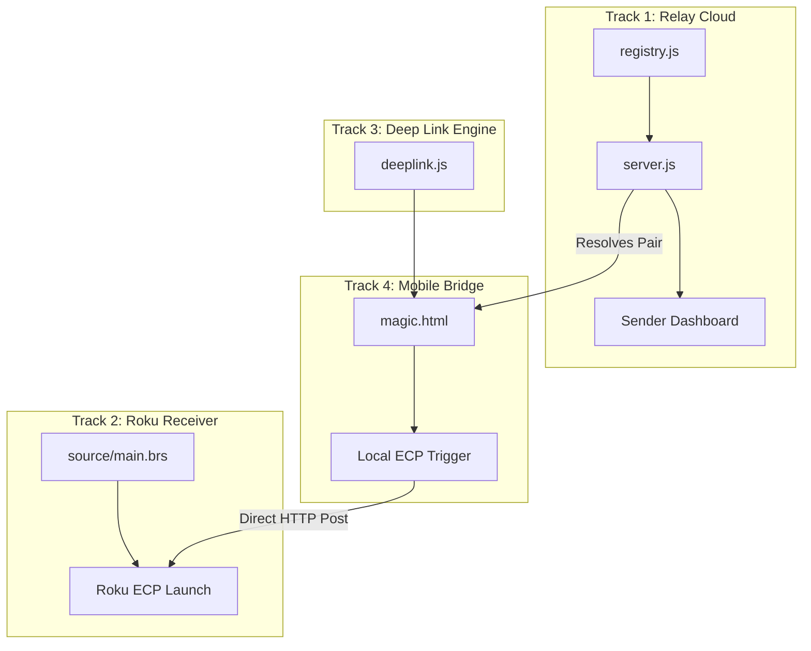

# Quickbeam Development & Execution Plan

This workspace skill defines the active tracks, architectural decisions, and testing protocols for the Quickbeam remote Roku bridge.

## 1. Project Roadmap (Multi-Track)



### 📋 Track Status & Tasks

#### ⚡ Track 1: Relay Cloud (Node.js)
*   [x] Initialize core relay server and IP-matching registry.
*   [x] Implement dynamic magic link creation and URL resolution.
*   [x] Build sender dashboard with status indicator.
*   [ ] **Next Up**: Secure session validation and link expiration (TTL).
*   [ ] **Next Up**: Robust device-matching for cases with multiple Rokus on one public IP.

#### 📺 Track 2: Roku Receiver (BrightScript)
*   [x] Create basic SceneGraph boilerplate.
*   [x] Implement heartbeat registration to Relay (POST `/api/register`).
*   [ ] **Next Up**: Display status interface showing connection state (e.g., "Ready for helper to cast").
*   [ ] **Next Up**: Generate fallback pairing code/QR code on screen if same-roof matching fails.

#### 🔗 Track 3: Deep Link Engine (JS)
*   [x] Basic parsing of YouTube, Netflix, Prime Video, and EWTN.
*   [ ] **Next Up**: Support for playlist IDs, timestamps, and search queries.
*   [ ] **Next Up**: Add support for Disney+, Hulu, and Max.

#### 📱 Track 4: Mobile Web Bridge (HTML/JS)
*   [x] Resolve recipient magic link from Relay.
*   [x] Attempt direct same-roof pairing via local IP.
*   [ ] **Next Up**: Handle Mixed Content security constraints (HTTPS -> HTTP local ECP).
*   [ ] **Next Up**: Implement manual pairing UI (IP input / QR scanner) for cellular/NAT failures.

---

## 2. Multi-Network Testing Configuration

To simulate a real-world deployment where the Relay is in the cloud, the Sender is remote, and the Recipient & Roku are on the same home network, we use a 2-Network setup.

### 🌐 Network Topology

```
                  ┌──────────────────────────────┐
                  │      Relay Cloud Server      │
                  │   (Runs on Gateway / Lenny)  │
                  └──────────────┬───────────────┘
                                 │
                 ┌───────────────┴───────────────┐
                 │        Alden Network          │
                 │    Public IP: [Alden Public]  │
                 └───────────────┬───────────────┘
                                 │ (Tailscale / WAN)
                 ┌───────────────┴───────────────┐
                 │         Home Network          │
                 │    Public IP: [Home Public]   │
                 └──────┬─────────────────┬──────┘
                        │                 │
             ┌──────────┴────────┐   ┌────┴──────────────┐
             │  Recipient Phone  │   │      Roku TV      │
             │   (Local IP: A)   │   │   (Local IP: B)   │
             └───────────────────┘   └───────────────────┘
```

### 🧪 Simulation Roles
*   **Relay Cloud Server**: Runs on `gateway` (or `lenny`) hosted on the **Alden Network**.
*   **Sender**: Accesses the web dashboard on the **Alden Network** or remotely.
*   **Recipient & Roku**: Connected to the **Home Network** (e.g., a phone and a Roku TV or simulator).

### ⚙️ Verification Steps
1. **Launch Relay**: Start the server on `gateway` / `lenny` (`npm start` in `/relay`).
2. **Launch Roku / Simulator**: Run the Roku app or simulator on the **Home Network**.
   * *Note: The Roku app/simulator must point to the Relay's reachable IP (e.g., its Tailnet IP or a configured local port forward).*
3. **Check Heartbeat**: Confirm the Relay registers the Roku under the **Home Network's public IP**.
4. **Generate Magic Link**: As a Sender, submit a video link to the dashboard to get a `magic.html` URL.
5. **Open on Phone**: Disconnect the recipient phone from the Alden network (ensure it is on the Home Network Wi-Fi). Load the magic link.
6. **Trigger Launch**: Tap "Play on TV". The phone should resolve the Roku's local IP from the Relay and send the command directly over the local Home Network.
